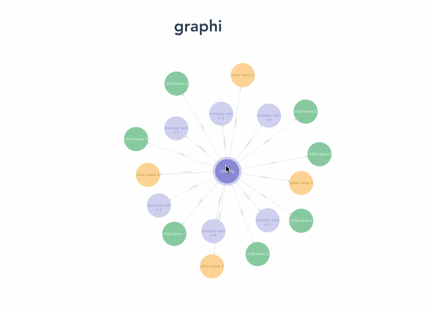

# Graphi

a high performance [d3.js](https://d3js.org/) graph tree data visualization component for vue2.x

#### Installation

```js
npm i @litt1e-p/graphi
```

#### Usage

1. global registration

```js
// in main.js
import Graphi from '@litt1e-p/graphi'
import '@litt1e-p/graphi/dist/graphi.css'

Vue.use(Graphi)
```

2. use as vue component

```js
// in your vue file
import { Graphi } from '@litt1e-p/graphi'

export default {
  components: {
    Graphi
  }
  ...
}
```

### Configuration

sample data for v-model:

```js
{
  "name": "d3js.org",
  "childs": [
    {
      "name": "child name 1"
    }
    ...
  ],
  "members": [
    {
      "name": "member name 1"
    }
    ...
  ],
  "outsides": [
    {
      "name": "other name 1"
    }
    ...
  ]
}
```

```js
<graphi v-model="your data to visualize"/>
```
for more detail

```js
<graphi v-model="your data to visualize" :conf="{ width: 1000, height: 500, zoomToFit: true, bubbleRadius: 60, arrowOffset: 2, fitScale: 0.6, relations: {'childs': 'sons', ...}}"/>
```


#### Screenshots

